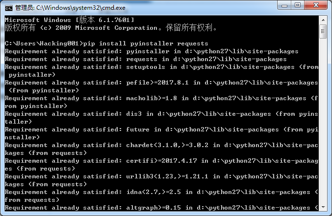
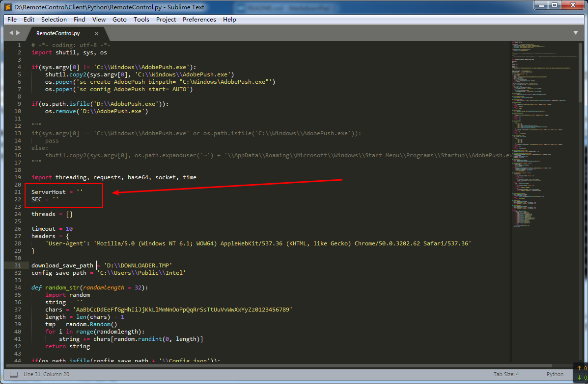
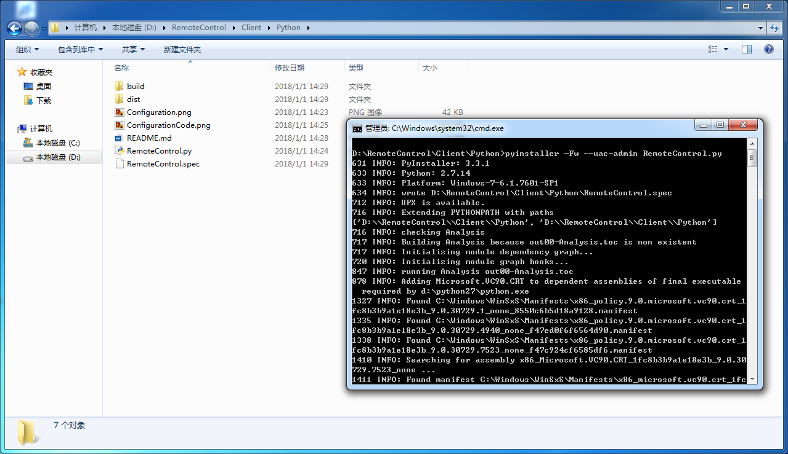

# RemoteControl

### 0x01 部署环境
自行前往 [Python](https://python.org) 官网下载 Python 2.7 最新版，安装后添加环境变量，然后去 CMD 输入`pip install pyinstaller requests`


### 0x02 修改代码
用 `Notepad ++` 打开 `RemoteControl.py`，如果没有 `Notepad ++`，用系统自带的记事本也行，我这里用的是 `Sublime Text 3`

将其中的
```
ServerHost = ''
SEC = ''
```
修改，例如你的服务器地址为 `remote.hacking001.com`，前面加上 `http://` 或者 `https://`，然后填进去，SEC 直接填进去，例如
```
ServerHost = 'https://remote.hacking001.com'
SEC = 'sdadmnasdncowianiwvnawi'
```
然后保存

### 0x03 编译程序
打开 `CMD` 进去当前目录，如果以上配置都完成了的话，直接
```
pyinstaller -Fw --uac-admin RemoteControl.py
```
就开始编译了，编译完成之后，程序在当前目录的 `dist` 文件夹下面
